# SpinalDevTofProject

This repository includes the code for a FPGA on the [ioda_lidar](https://github.com/plex1/ioda_lidar) project. 
- Logicware
  - RiscV (VexRisc) softcore CPU
  - Time-of-flight 
     - start pulse generation
     - time-to-digital converter based propagation delay of look-up-tables (LUTs)
     - histogram of deteccted delays
- Embedded software (on RiscV)
   - Protocol (Gepin) which forwards read and write request from UART to the internal bus (mainly to the  time-of-flight logic)


## Compilation and testing

1. Startup [SpinalDev](https://github.com/plex1/SpinalDev) docker environment.
2. Within docker, clone this repository into the user folder:
```
cd /home/spinaldev/projects/user
git clone https://github.com/plex1/SpinalDevTofProject.git   
```
3. Run project specific actions
```
./project.bash run -n SpinalDevTofProject -t soc -a fwcompile  # compile hdl and generate verilog
./project.bash run -n SpinalDevTofProject -t soc -a swbuild    # build sw and and genrate binary
./project.bash run -n SpinalDevTofProject -t soc -a fwtest     # run testbench (needs sw binary)
```


## Remarks

- This repos was adopted from [SpinalDevTemplateSoc](https://github.com/plex1/SpinalDevTemplateSoc)
- Tested on [FPGA board (Olimex)](https://www.olimex.com/Products/FPGA/iCE40/iCE40HX8K-EVB/open-source-hardware)
- Programming and debugging of FPGA/SW has been done with a Raspberry Pi, see [raspice40](https://github.com/plex1/raspice40). The follwing commands have been used:
```
./project.bash run -n SpinalDevTofProject -t soc -a configfile_copy
./project.bash run -n SpinalDevTofProject -t soc -a configfile_prog
```

# Purpose and Scope
The purpose of this document is to describe the design of a time-to-digital converter implemented in an FPGA. It may be implemented in an ASIC at a later stage.

# Introduction
A time-to-digital converter (TDC) is a device that converts a time difference into a digital value. Logic elements, chain structures, and registers in FPGA can be used to perform such a time-to-digital conversion [1]-[3]. The uneven bin size in FPGAs causes large differential non-linearities (DNL), a major issue in FPGA TDCs, but this can be solved with calibration [2]. This document provides a description of the FPGA design, including control software, test setup, and results.

# System Description
A block diagram of the system is shown in Figure 1. The setup is controlled by a PC/laptop that can control the FPGA over a Control and Status interface via an FTDI USB/UART converter. The Raspberry Pi single-board computer is used to program the flash and to debug the embedded software of the FPGA via JTAG. A periodical start trigger signal (TrigOut) is forwarded to a configurable delay-line. Its output is sent back to the FPGA as a stop signal (TrigIn), where the delay is measured.

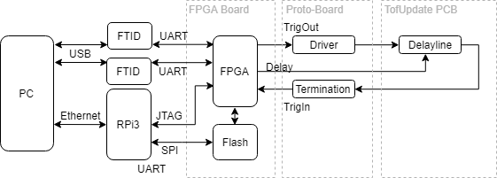

The separate units are described in Table 1. A photo of the setup is shown in Figure 2, which shows an aluminum plate with the FTDI, RPi3, FPGA board, and proto board mounted. The TofUpgrade PCB is shown on the right.

| Unit            | Description                         |
| --------------- | ----------------------------------- |
| PC              | Ordinary laptop, Windows, Virtual Box installed |
| FTDI            | FTDI USB/UART converter              |
| RPi3            | Raspberry Pi 3 Model B/ARM Cortex-A53/q |
| FPGA Board      | iCE40HX8K-EVB                       |
| Proto-Board     | Prototyping Board                   |
| TofUpgrade PCB  | See Project Report: Time-of-flight upgrade |

*Table 1: Units in System Setup*

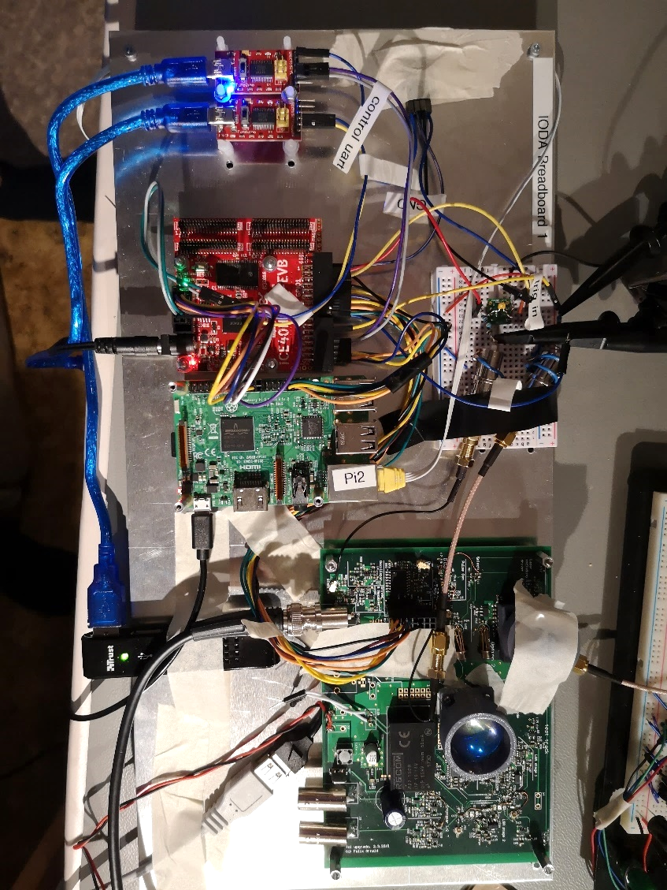

## PC
### Design Software
The following tools have been used:

- Windows Laptop
- Virtual Box with Ubuntu Mate 16.04
- Docker Image for development: [SpinalDev](https://github.com/plex1/SpinalDev)
- PyCharm Community for testing

## FTDI
A custom off-the-shelf FTDI board was used to connect to the control UART. A second FTDI board is used as a debug UART.

## Raspberry Pi 3
The Raspberry Pi 3+ is used for programming the FPGA and JTAG. The following software package has been installed for that purpose: [Raspice40](https://github.com/plex1/raspice40/blob/master/install.sh).

The following software is installed:

- FlashPROM Flash Programming: [Flashrom](https://github.com/flashrom/flashrom)
- OpenOCD RiscV: [OpenOCD RiscV](https://github.com/SpinalHDL/openocd_riscv), using git commit `7aef0a`, Jan 2 2019, due to compatibility issues with the latest version.

## FPGA Board
The FPGA development board iCE40HX8K-EVB from Olimex is used. The content of the FPGA configuration can be found here: [SpinalDevTof](https://github.com/plex1/SpinalDevTof). Included are:

- FPGA logic-ware
- Soft core RiscV processor ([VexRiscv](https://github.com/SpinalHDL/VexRiscv))
- Embedded software

# FPGA Design
In Figure 3, the block diagram of the FPGA logic is shown. The control and status interface is done over a UART. This communication is handled by the VexRiscV processor in the SoC. The Tof logic is implemented in a peripheral that is connected to the SoC via AXI bus. The following functional blocks are part of the TofPeripheral:

- **PulseGen**: The pulse generator generates a square wave signal with a configurable repetition frequency. The frequency has been set to roughly 1 MHz.
- **Ring Oscillator**: The ring oscillator generates a square wave signal from logic. It has roughly the same frequency as the pulse generator. Its main feature is that it oscillates asynchronously to the 12MHz/40MHz clock in the rest of the FPGA. Therefore, this signal is ideal for synchronization purposes.
- **Coarse Counter**: The coarse counter counts the number of clock cycles between the TrigOut (aka Start) and the TrigIn (aka Stop) signal. This value is an integer number, while the fractional part of the delay is evaluated in the delay line.
- **DelayLine**: The delay line is used to measure a time delay much smaller than the clock period by measuring the propagation of the signal in a concatenated series of logic elements.
- **TriggerFinder**: The trigger finder extracts the time of the received trigger signal from the values of the latched logic elements from the delay line.
- **Filter**: Filters out the relevant trigger time value from the trigger finder by using the coarse counter. This is required because the delay line is longer than one clock period, and therefore a trigger is found during several clock cycles.
- **Histogram**: Creates a histogram from the trigger time values. The histogram can be cleared and read out via AXI bus.
- **Delay Settings**: Delay settings for the external variable delay chip can be configured.

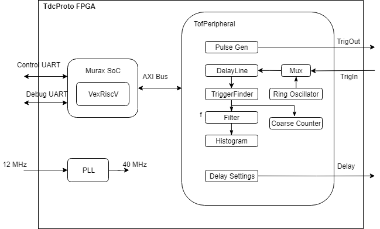

## Ring Oscillator
The ring oscillator is generated with the logic primitive LUT4 (see [4]), which is configured to forward the input I1 to the output O (buffer). This output is divided by 32 by using an adder to generate a signal in the order of 1 MHz.

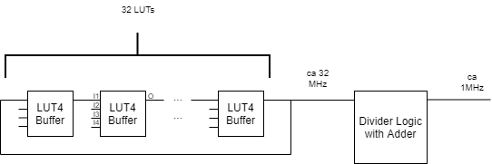

## Tapped Delay Line
The tapped delay line is generated with the logic primitive LUT4 and DFF (see [4]). The delay line has 128 taps.

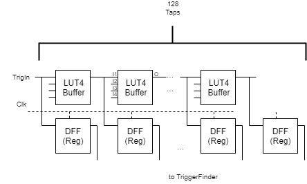

### FPGA Layout / Floorplanning
The layout of the FPGA is shown in Figure 6. The placement of the elements in the delay line has been constrained to the lower left corner. Adjacent taps in the delay line are placed in neighboring BELs.

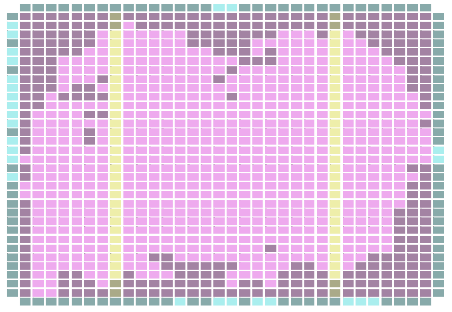
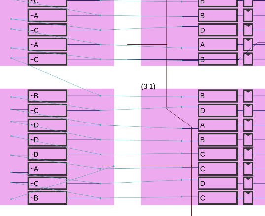

### FPGA Resources
53% of the FPGA's Logic Cells are occupied.

**Final Design Statistics:**

- Number of LUTs: 3980
- Number of DFFs: 1842
- Number of DFFs packed to IO: 0
- Number of Carrys: 336
- Number of RAMs: 28
- Number of ROMs: 0
- Number of IOs: 23
- Number of GBIOs: 0
- Number of GBs: 8
- Number of WarmBoot: 0
- Number of PLLs: 1

**Device Utilization Summary:**

- LogicCells: 4036/7680
- PLBs: 676/960
- BRAMs: 28/32
- IOs and GBIOs: 23/206
- PLLs: 1/2

### FPGA Timing
The timing has to be rechecked. Due to the delay line, the timing of the main clock is no longer checked. It was not possible with the nextpnr toolchain to set the delay line as a false path or to look at the second fastest path. Without the delay line, the performance is around 50 MHz according to nextpnr timing analysis. The main clock has a frequency of 40 MHz. Thus there is a 10 MHz margin. The delay line has a total maximum delay of 137 ns.

### Testing
A testbench has been written to check its functionality. The logic is controlled by writing and reading via the Control and Status interface (Gepin). In the testbench, the embedded system with software is running, and the FPGA logic is running concurrently, allowing for complete data and control flow testing.

## Drivers
A TinyLogic UHS Dual Buffer NC7WZ16 IC was used as a driver. A 50 Ohms resistor was placed at the output (output impedance). The circuit can drive a 50 Ohms load. A 50 Ohms resistor was used as a termination resistor.

## TOF Upgrade PCB
See [5] for more details on this PCB. For the purpose of this document, only the delay-line functionality of the PCB is used.

### Variable Delay Chip
A DS1023, 8-Bit Programmable Timing Element, chip is present on the board. This chip can vary the delay from 0-64 ns with a step size of 0.25 ns. This allows for convenient automated testing of the FPGA TDC.

# Testing
## Procedure
The test setup is as shown in the section System Description.

## Testing Software and Framework
A test framework in Python has been built: [ioda_control_sw](https://github.com/plex1/ioda_control_sw).

The framework has the following functionality:

- Definition of unit hierarchy: A hierarchy of units and subunits for the device under test as well as units used for testing (e.g., power supply) can be defined.
- Definition of test interfaces: A list of interfaces the test cases use needs to be defined.
- Definition of test cases: A list of test cases (which are themselves well-defined Python classes) can be defined. The test cases have a run, and evaluate method.
- Selection and filtering of test cases to be run.
- Logging of data and text from the test cases.
- All data and definitions are stored in databases.
- Configuration and status registers (CSR) definition files.
- Automatic GUI generation based on CSR.
- Support for requirements management and evaluation.
- Automatic reports of test case results and requirements.
- All tests run automatically without intervention from the user and automatically produce the data and graphs shown in this section.

To control the FPGA, a memory map protocol is used, called Gepin (General Purpose Interface). Gepin allows for reading and writing from addresses. The length of the data to be read/written is variable. For requests with a length longer than one, a flag can be used to set the increase or fixed address mode. Fixed address mode can, for example, be used to write to FIFOs.

The test cases are defined in `TofTestCases.py`. The test can be run from `TofTest.py`.


## Results
First, the FPGA is configured to record the output of the ring oscillator. Because the trigger input into the delay line from the ring oscillator is completely independent of the 40 MHz clock, stochastic methods can be applied. The distribution of the trigger with respect to the 40 MHz clock is measured with the delay line and saved in a histogram. The histogram is shown in Figure 8 a). We see that the distribution is quite non-uniform, with counts ranging from 25,000 to 42,000. Thus, calibration will be essential. Note that the number of counts recorded per tap is proportional to the delay of the signal in this tap. The delay per tap is shown in Figure 8 b), and the calculation of the values is explained later.

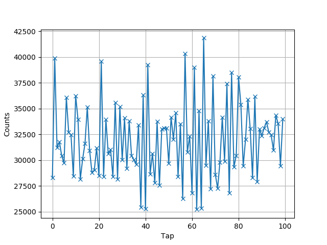, 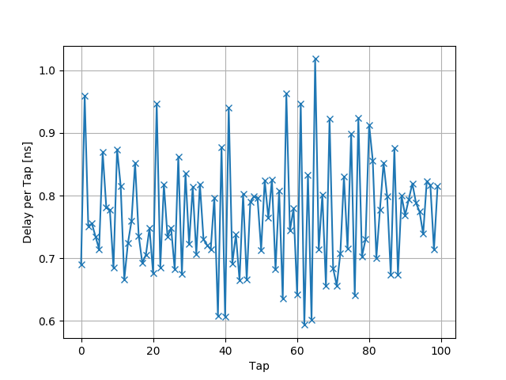

### Calibration
In a second step, the ring oscillator is deactivated, and the signal from the IO TrigIn is received. The trigger signal at the FPGA output and the delayed version at the input are measured and shown in Figure 9.

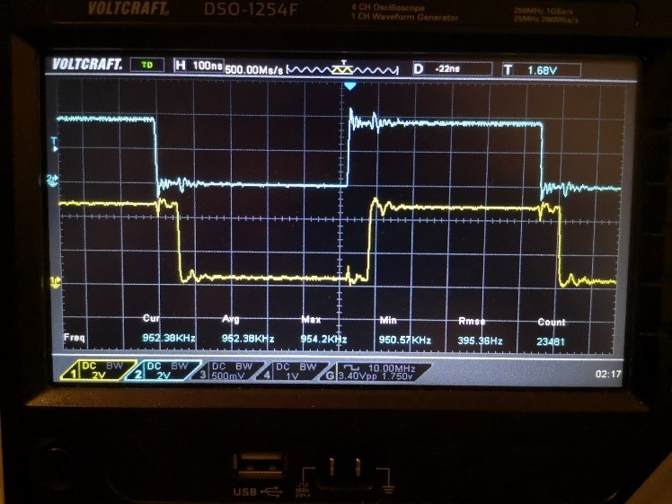 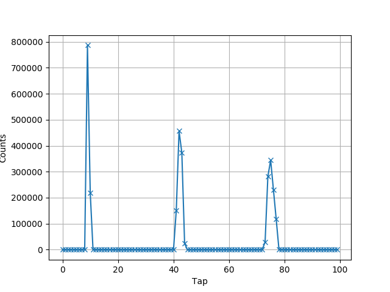

In order to measure the time between pulses, an additional histogram is generated, which shows several pulses. This can be achieved by configuring the filter entity accordingly. These pulses are actually the same rising edge of the TrigIn signal but sampled at several clock cycles. These clock cycles are 1/40 MHz = 12.5 ns apart. We can now process this histogram and measure the number of (integer and fractional) taps between the mean of two consecutive pulses. Because the tap delay is not constant, this is not very accurate. Instead, we calculate the number of counts during this period (12.5 ns) from Figure 8 a). The fractional part of the pulse positions is considered as well. We now have the delay per count and can produce Figure 8 b). The known delay per tap is now used to calibrate each measurement of the TDC. See `TofProcessing.py` for the complete calibration and measurement algorithm.

If we have a closer look at Figure 9 a), we can see an interesting phenomenon: the pulses get broader as they travel down the delay line. This can be explained by the additional timing jitter each tap delay element introduces. The jitter adds up (RMS) and gets larger the more taps are traversed.

### Delay Sweep Measurements
To measure the performance of the TDC, a delay sweep is performed. For each delay setting of the external variable delay, the measured delay by the TDC is recorded. The delay code is swept from 0-141, corresponding to 0 ns - 35 ns. The result is shown in Figure 10 a). Because the external variable delay chip has integral non-linearity up to +/- 1 ns (see DS1023 [6]) itself, the data is offset and gain corrected for further processing.

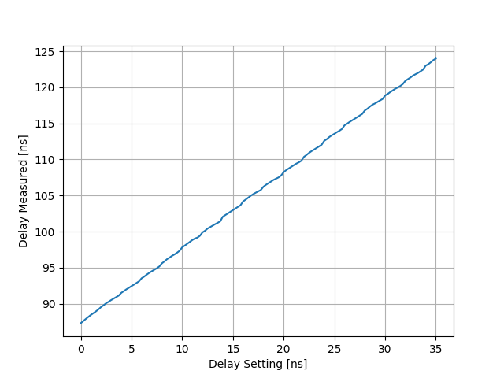 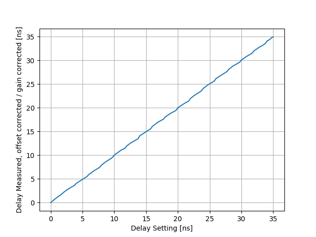

In Figure 11, the difference between two consecutive delay settings is shown, which corresponds to the step size. The offset and gain-corrected data has been used. We can make the following observations:

- On average, the difference is 250 ps, which corresponds to the step size of the DS1023.
- There is a repeating pattern where the difference is greater for every 8th step (every 2 ns). This corresponds to the structure within the DS1023 chip, where there is a distinction between fixed array elements, which are 2 ns, and the ‘SubDAC’ which provides the 0.25 ns resolution [6].
- The tap size fluctuates greatly. However, the values are still in accordance with the data sheet (delay step size = 0..0.75 ns).
- The same measurement has been performed twice (a) and b)). The two data sets show a very close match, which proves that the measurements are very repeatable.


The measurement error, i.e., the deviation between the measured values and a straight line drawn between the step zero value and the maximum programmed delay time, has also been calculated and plotted in Figure 12. We see that the values are mostly within +/- 250 ps, where most of the error is probably coming from our reference, the DS1023 chip.


## Script Output
The test script summary output is shown below. All tests have passed.

```
TestID : 20190916-154813_toffpga_TestCaseID
Number of checks: 1
Number of errors: 0

Check Description: Read out ID, Type: is_equal, Actual: 26, Expected: 26
--
TestID : 20190916-154813_toffpga_TestCaseCalibrate
Number of checks: 2
Number of errors: 0
Check Description: Check cd_norm_std [in ns] upper bound, Type: is_smaller, Actual: 0.007047696424866082, Expected: 0.01
Check Description: Check period_std [in ns] upper bound, Type: is_smaller, Actual: 0.022183052937469264, Expected: 0.03
--
TestID : 20190916-154813_toffpga_TestCaseMeasure
Number of checks: 1
Number of errors: 0
Check Description: Check error bound, Type: is_smaller_all, Actual: [0.0, 0.027192635197916926, 0.05802354948144084, 0.07348233029495144, 0.07810061840101357, 0.06832109645153661, 0.03944869754506097, ..., 0.02466519261582789, 0.0], Expected: 0.35
--
```

# To-Do
- Add timing ignore flag TMG_IGNORE for the delay line registers and constrain clocks properly.
- Improve placement constraints for the delay line cells.

# Recommendations
- Use Carry Chain primitives for the delay elements in the delay line. The delay of these primitives is an order of magnitude lower than the LUTs and will provide a better TDC measurement resolution.
- The logic to read out the delay line should be running at a higher frequency to increase the accuracy further (now clocked with 40 MHz).

# Conclusions
We have demonstrated a TDC within an FPGA with an accuracy of better than +/- 250 ps after calibration. This value could be much smaller. However, due to the specification of our reference variable delay chip, more accurate measurements were not possible. The measurements were performed with an automated test framework.

# References

[1] C. Favi, E. Charbon, A 17ps Time-to-Digital Converter Implemented in 65nm FPGA Technology  
[2] J. Wu, Z. Shi, The 10ps Wave Union TDC: Improving FPGA TDC Resolution beyond Its Cell Delay  
[3] C. Liu, Y. Wang, A 128-Channel, 710 M Samples/Second, and Less 10 ps RMS Resolution Time-to-Digital Converter Implemented in a Kintex-7 FPGA  
[4] LATTICE ICE™ Technology Library Version 2.9 March 23, 2015.  
[5] Project: Time-of-Flight Upgrade, Documentation  
[6] DS1023, 8-Bit Programmable Timing Element, Data Sheet


